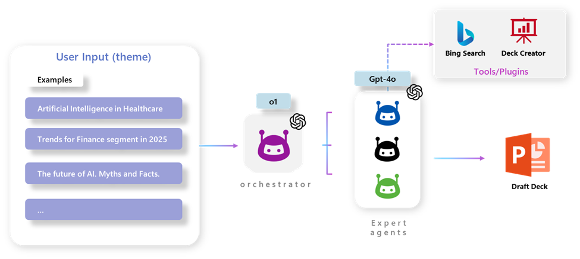

# AI Multi-Agent Presentation Builder

Create draft presentations effortlessly with the power of AI. This project leverages multiple AI agents to collaboratively generate presentation content based on user input. 

In this repository, we demonstrate how to use **Semantic Kernel** to orchestrate Multi-Agent systems using **Azure OpenAI** models. We use a swarm agent architecture with **o1-mini** as the orchestrator and **gpt-4o-mini** model as the LLM for the task-oriented agents.

**Semantic Kernel** is utilized for agent orchestration, enabling seamless coordination and communication between different AI agents. By leveraging Semantic Kernel, the system efficiently manages task delegation, context sharing, and workflow automation, ensuring that each agent contributes effectively to the content creation process.

This repository is designed for **learning purposes**, offering insights into the development and integration of multi-agent systems for automated content creation.
The deck created is only to demonstrate how to add external capabilities with custom Plugins, but there is no intention 

The diagram below shows how the orchestrator create the agents and the expert agents collaborate with each other to accomplish the goal:



The **Expert agents** are dynamically created and have a level of autonomy to accomplish its tasks. Each one will be responsible for a specific task (given by the orchestrator).

## Features

This project framework provides the following features:

* **Dynamic Agent Creation**: Automatically generates AI agents tailored to specific tasks.
* **Collaborative AI**: Multiple AI agents work together to create comprehensive presentations.
* **Streamlit Integration**: User-friendly web interface for seamless interaction.
* **Customizable Templates**: Use Jinja templates to define agent behaviors and prompts.
* **Presentation Export**: Generate and download presentations in PPTX format.

## Demo


## Getting Started

### Prerequisites

- Python 3.8+
- Azure OpenAI API Key
- Bing API Key

### Installation

1. Clone the repository:
    ```sh
    git clone [repository clone url]
    cd [repository name]
    ```

2. Install the required Python packages:
    ```sh
    pip install -r requirements.txt
    ```

3. Set up your environment variables:
    - Copy  to  and fill in your API keys and other configurations.
    - You can use the [.env.sample](.env.sample) file to adjust your own environment variables. Rename the file to `.env` and change each one with your own data.

### Quickstart

1. Run the Streamlit app:
    ```sh
    streamlit run app.py
    ```

2. Open your browser and navigate to `http://localhost:8501`.

3. Enter a theme for your presentation and let the AI agents do the rest!

## Demo

A demo app is included to show how to use the project.

To run the demo, follow these steps:

1. Ensure all prerequisites are met.
2. Follow the Quickstart guide to run the Streamlit app.
3. Interact with the AI agents and generate a presentation.

## Resources

- [Azure OpenAI Documentation](https://learn.microsoft.com/en-us/azure/cognitive-services/openai/)
- [Streamlit Documentation](https://docs.streamlit.io/)
- [Jinja Documentation](https://jinja.palletsprojects.com/)

## Contributing

This project welcomes contributions and suggestions. Please open a PR and it will be analyzed as soon as possible.

## License

This project is licensed under the MIT License. See the  file for details.
